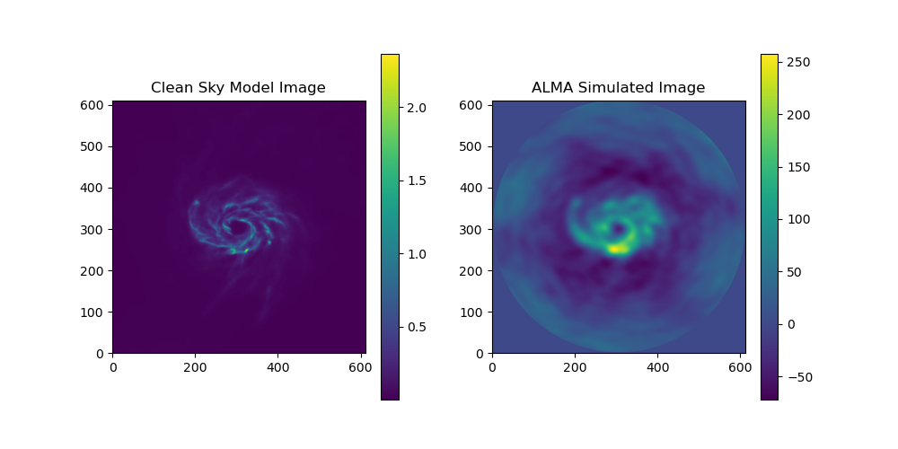
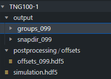

# ALMASim
 

ALMASim is a package to generate mock observations of HI line galaxies as observed by the Atacama Large Millimetre/Submillimetre Array (ALMA). ALMASim primary goal is to allow users to generate simulated datasets on which to test deconvolution and source detection models. ALMASim is intended to leverage MPI parallel computing on modern HPC clusters to generate thousands of ALMA data cubes. Users are free to set both source and observational parameters such as antenna configuration, bandwidth, integration time and so on, or completely generate data using random configuration and sources.
ALMASim is built upon the CASA PiP Wheels (https://casadocs.readthedocs.io/en/latest/index.html), the MARTINI Package (https://github.com/kyleaoman/martini), and the Illustris Python Package (https://github.com/illustristng/illustris_python) to be able to generate observations of both high redshift point-like sources and close extendend sources in all possible ALMA configurations. 
For every observed target ALMASim generates:
- A Sky model .fits cube containing the source without any source of noise or instrumental effects;
- A Dirty .fits cube, i.e. the Fourier inversion of the observed visibilities 
- A Measurements set .npy file containing the measured visibilities as a numpy array 
- A parameters.csv containing the observational and source parameters

## Installation
1 Clone the GitHub repository and move into it:
<pre><code>git clone https://github.com/MicheleDelliVeneri/ALMASim.git</code></pre>
<pre><code>cd ALMASim</code></pre>

2 Create a conda environment from the provided requirements and activate it:
<pre><code>conda create --name casa6.5 --file requirements.txt </code></pre>
<pre><code>conda activate casa6.5 </code></pre>

3 Install the illustris_python package:
<pre><code> git clone git@github.com:illustristng/illustris_python.git </code></pre>
<pre><code> cd illustris_python </code></pre>
<pre><code> pip install . </code></pre>

4 If you are interested in simulating Extended sources, you need to download and configure the Illustris TNG100-1 simulation folder.

The picture shows an example for Snapshot-99, reproduce this for every Snapshot you are interested i. You can check more at the Illustris TNG official website: https://www.tng-project.org/data/

6. Install the required packages 
<pre><code> pip install -r requirements.txt  </code></pre>

## Usage
To run the simulation, just navigate to the ALMASim folder and execute 
<pre><code> python main.py --option value --option1 value1 value2  </code></pre>
to check the available option run 
<pre><code> python main.py -h </code></pre>

**Happy Simulations**

### Cite us

Michele Delli Veneri, Łukasz Tychoniec, Fabrizia Guglielmetti, Giuseppe Longo, Eric Villard, 3D Detection and Characterisation of ALMA Sources through Deep Learning, Monthly Notices of the Royal Astronomical Society, 2022;, stac3314, https://doi.org/10.1093/mnras/stac3314

@article{10.1093/mnras/stac3314,
    author = {Delli Veneri, Michele and Tychoniec, Łukasz and Guglielmetti, Fabrizia and Longo, Giuseppe and Villard, Eric},
    title = "{3D Detection and Characterisation of ALMA Sources through Deep Learning}",
    journal = {Monthly Notices of the Royal Astronomical Society},
    year = {2022},
    month = {11},
    issn = {0035-8711},
    doi = {10.1093/mnras/stac3314},
    url = {https://doi.org/10.1093/mnras/stac3314},
    note = {stac3314},
    eprint = {https://academic.oup.com/mnras/advance-article-pdf/doi/10.1093/mnras/stac3314/47014718/stac3314.pdf},
}
