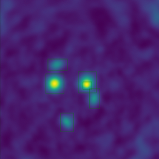

# ALMASim

A python package to make realistic simulations of ALMA observations of galaxies and point sources. For now, only simple point-like sources are generated, but soon more complex Galaxy models will be added. The project, at its current status, is able to:
- Create Sky Model Cubes of randomly scattered point-like sources;
- Generate corresponding calibrated Dirty Cubes;
- Generate tCLEAN cleaned counterparts to the Dirty Cubes;
- Generate a .csv file containing all source positions and morphological properties.

The main scope of this repository is to let scientistis generate their own simple ALMA simulions on which to train and test their models.

## Generating ALMA simulations for the ML imaging purposes

Instructions:

1 Create a conda environment:

<pre><code>conda create --name casa6.5 python=3.8 </code></pre>

2 Activate it:

<pre><code>conda activate casa6.5</code></pre>

3 Move to the folder where you want to store the results
4 Clone the GitHub repository:

<pre><code>git clone https://github.com/MicheleDelliVeneri/PyALMASim.git </code></pre>

5 Make sure that the required libraries are installed, we are supposing to be on a centos system:

<pre><code>sudo yum install ImageMagick*</code></pre>
<pre><code>sudo yum install xorg-x11-server-Xvfb</code></pre>
<pre><code>sudo yum install compat-libgfortran-48</code></pre>
<pre><code>sudo yum install libnsl</code></pre>
<pre><code>sudo yum install openmpi-devel</code></pre>
<pre><code>sudo yum install mpich-devel</code></pre>
<pre><code>sudo yum install parallel</code></pre>

6 Install the required python libraries

<pre><code>pip install -r requirements.txt</code></pre>

7 Generate the sky model cubes:
modify the create_models.sh script with the number of cpus-per-task you want to use. This is the number of cubes that will be created in parallel. This could be set to the maximum number of cores on a given node.

<pre><code>sbatch create_models.sh models sims params.csv 10000 </code></pre>

where the first parameter <b>models</b> is the name of the directory in which to store the <b>sky models</b> cubes, the second <b>sims</b> is the name of the directory in which to store the simulations, the third <b>params.csv</b> is the name of the .csv file which holds the sources parameters and the fourth <b>n</b> is the number of cubes to generate
8 Generate the ALMA simulations:
In order to generate the simulations, we are going to run the <b>run_simulations.sh</b> script in parallel with sbatch.
First, after running the create_models script, you should first see the models directory populated with sky models .fits files, but also a <b>sim_param.csv</b> file in the root folder.
This file is used by the <b>run_simulations.sh</b> bash script to generate the simulations in parallel through sbatch. To do so first modify the --aray field with the number of parallel tasks you want to use and modify NUMLINES so that NUMLINES * array equals the number of .fits file in the models folder, and then run it with the following command:

<pre><code>sbatch run_simulations.sh
 </code></pre>

The script assumes that your conda environment is called conda6.5, otherwise, modify its name in the script at line 9.
9 Now that the simulations are concluded, we need to update the parameters in the <b>params.csv</b> file with the fluxes and continuum values. To do so, run the following command:

<pre><code>python generate_parameters.py models sims params.csv 0.</code></pre>

or if you want to run it via slurm: 
<pre><code>srun -n 1 -c 32 python generate_params.py models sims params.csv 0.15</code></pre>
where 0. is an examplary value for the noise rms. In case you want to add additional white noise to the simulations, increase this value. 

10 create also the tCLEAN counterparts by running
<pre><code>sbatch run_tclean.sh
 </code></pre>

 you are set, enjoy your simulations!

 ## Work in progress
 - Introduce single target observations;
 - Introduce different array configurations;
 - Store the dirty beam;
 - Introduce Galaxy dynamic and complex spectral profiles;
 - Introduce multi-line emissions / absorptions;
 - Introduce source classes;

### Cite us

Michele Delli Veneri, Łukasz Tychoniec, Fabrizia Guglielmetti, Giuseppe Longo, Eric Villard, 3D Detection and Characterisation of ALMA Sources through Deep Learning, Monthly Notices of the Royal Astronomical Society, 2022;, stac3314, https://doi.org/10.1093/mnras/stac3314

@article{10.1093/mnras/stac3314,
    author = {Delli Veneri, Michele and Tychoniec, Łukasz and Guglielmetti, Fabrizia and Longo, Giuseppe and Villard, Eric},
    title = "{3D Detection and Characterisation of ALMA Sources through Deep Learning}",
    journal = {Monthly Notices of the Royal Astronomical Society},
    year = {2022},
    month = {11},
    abstract = "{We present a Deep-Learning (DL) pipeline developed for the detection and characterization of astronomical sources within simulated Atacama Large Millimeter/submillimeter Array (ALMA) data cubes. The pipeline is composed of six DL models: a Convolutional Autoencoder for source detection within the spatial domain of the integrated data cubes, a Recurrent Neural Network (RNN) for denoising and peak detection within the frequency domain, and four Residual Neural Networks (ResNets) for source characterization. The combination of spatial and frequency information improves completeness while decreasing spurious signal detection. To train and test the pipeline, we developed a simulation algorithm able to generate realistic ALMA observations, i.e. both sky model and dirty cubes. The algorithm simulates always a central source surrounded by fainter ones scattered within the cube. Some sources were spatially superimposed in order to test the pipeline deblending capabilities. The detection performances of the pipeline were compared to those of other methods and significant improvements in performances were achieved. Source morphologies are detected with subpixel accuracies obtaining mean residual errors of 10−3 pixel (0.1 mas) and 10−1 mJy/beam on positions and flux estimations, respectively. Projection angles and flux densities are also recovered within \\$10\\\\%\\$ of the true values for \\$80\\\\%\\$ and \\$73\\\\%\\$ of all sources in the test set, respectively. While our pipeline is fine-tuned for ALMA data, the technique is applicable to other interferometric observatories, as SKA, LOFAR, VLBI, and VLTI.}",
    issn = {0035-8711},
    doi = {10.1093/mnras/stac3314},
    url = {https://doi.org/10.1093/mnras/stac3314},
    note = {stac3314},
    eprint = {https://academic.oup.com/mnras/advance-article-pdf/doi/10.1093/mnras/stac3314/47014718/stac3314.pdf},
}