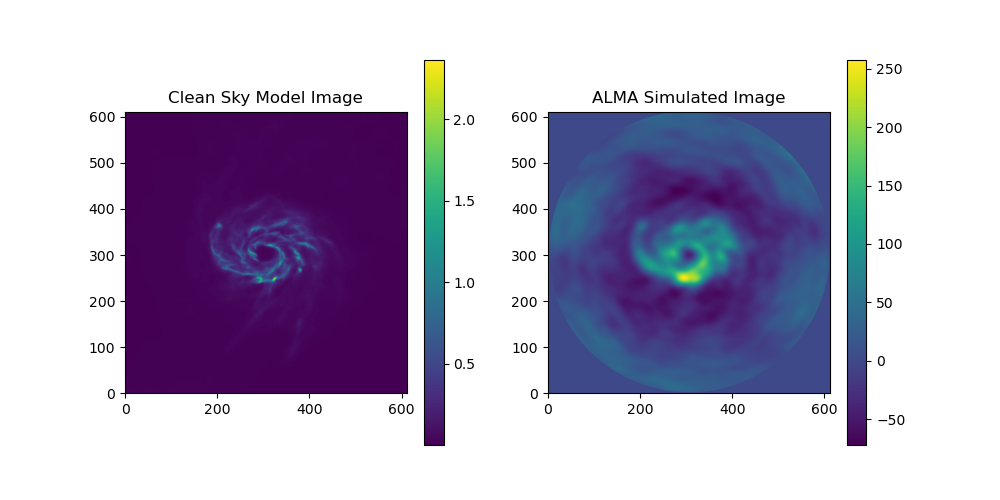

Overview
========

.. INTRO_START_LABEL

ALMASim is a package to generate mock observations of HI line galaxies as observed by the Atacama Large Millimetre/Submillimetre Array (ALMA). ALMASim primary goal is to allow users to generate simulated datasets on which to test deconvolution and source detection models. ALMASim is intended to leverage MPI parallel computing on modern HPC clusters to generate thousands of ALMA data cubes. Users are free to set both source and observational parameters such as antenna configuration, bandwidth, integration time and so on, or completely generate data using random configuration and sources.
ALMASim is built upon the CASA PiP Wheels (https://casadocs.readthedocs.io/en/latest/index.html), the MARTINI Package (https://github.com/kyleaoman/martini), and the Illustris Python Package (https://github.com/illustristng/illustris_python) to be able to generate observations of both high redshift point-like sources and close extendend sources in all possible ALMA configurations. 
For every observed target ALMASim generates:

- A Sky model .fits cube containing the source without any source of noise or instrumental effects;
- A Dirty .fits cube, i.e. the Fourier inversion of the observed visibilities 
- A Measurements set .npy file containing the measured visibilities as a numpy array 
- A parameters.csv containing the observational and source parameters

.. INTRO_END_LABEL

Citing ALMASim
--------------

.. CITING_START_LABEL
   
If you use ALMASim in your research, please cite the following paper:

.. code-block:: bibtex

    @ARTICLE{10.1093/mnras/stac3314,
    author = {Delli Veneri, Michele and Tychoniec, Łukasz and Guglielmetti, Fabrizia and Longo, Giuseppe and Villard, Eric},
    title = "{3D Detection and Characterisation of ALMA Sources through Deep Learning}",
    journal = {Monthly Notices of the Royal Astronomical Society},
    year = {2022},
    month = {11},
    issn = {0035-8711}, 
    doi = {10.1093/mnras/stac3314},
    url = {https://doi.org/10.1093/mnras/stac3314},
    note = {stac3314},
    eprint = {https://academic.oup.com/mnras/advance-article-pdf/doi/10.1093/mnras/stac3314/47014718/stac3314.pdf}
    }

.. _ALMASim entry: https://doi.org/10.1093/mnras/stac3314

.. CITING_END_LABEL

Installation Notes
==================
.. INSTALLATION_NOTES_START_LABEL

ALMASim works with ``python3`` (version ``3.8``), and does not support ``python2``.
First create a virtual environment with ``python3`` and activate it. Then install the required packages with ``pip``:

- python3.8 -m venv astro-env
- source astro-env/bin/activate
- pip install --upgrade --extra-index-url https://go.nrao.edu/pypi casadata
- pip install casatools==6.5.6.22
- pip install casatasks==6.5.6.22
- pip install numpy h5py astropy scipy matplotlib pandas tqdm hdecompose spectral-cube astromartini dask distributed dask[distributed]  natsort nose coverage nifty8 notebook
- git clone https://github.com/illustristng/illustris_python.git
- cd illustris_python
- pip install .
- cd ..
- git clone https://github.com/MicheleDelliVeneri/ALMASim.git
- cd ALMASim

.. INSTALLATION_NOTES_END_LABEL

Getting started
===============

.. QUICKSTART_START_LABEL

To run the simulation, just navigate to the ALMASim folder and execute 
``python main.py --option value --option1 value1 value2``
to check the available option run 
``python main.py -h``
If you are interested in simulating Extended sources, you need to download and configure the Illustris TNG100-1 simulation folder.
TNGStructure.PNG shows an example for Snapshot-99, reproduce this for every Snapshot you are interested i. You can check more at the Illustris TNG official website: https://www.tng-project.org/data/  

.. QUICKSTART_END_LABEL
